  
# THE WICKED WITCH OF THE WORLD WIDE WEB  
  
```  
<!--   
Kiara Jouhanneau  
  
Thesis submitted to the Department of Experimental Publishing, Piet Zwart Institute, Willem de Kooning Academy, in partial fulfilment of the requirements for the final examination for the degree of Master of Arts in Fine Art & Design: Experimental Publishing.  
  
Adviser: Lídia Perreira  
Second Reader: Michael Murtaugh  
Word count:   
  
– – –    
This work has been produced in the context of the graduation research of Kiara Jouhanneau from the Experimental Publishing (XPUB) Master course at the Piet Zwart Institute, Willem de Kooning Academy, Rotterdam University of Applied Sciences.  
  
XPUB is a two year Master of Arts in Fine Art and Design that focuses on the intents, means and consequences of making things public and creating publics in the age of post-digital networks.    
https://xpub.nl  
  
This publication is based on the graduation thesis The Wicked Witch of the World Wide Web, written under the supervision of Lídia Perreira, Manetta Berends, Kamo and Michael Murtaugh.   
  
The written content of this publication is licensed under …    
The external resources mentioned or used in this publication (such as writings, images, audio, video or any web medium) are subject to the licensing of their authors.  
  
---  
## Abstract  
This essay is about magic, politics and the web. It is about community, resistance and humanity.    
This research presents magic as a process: intuition → intention → action. This process is fluid, almost organic and observe the mind and the body as forces that are meant to communicate and be entangled, rather than separate. The idea of that magic is to perceive and maybe produce harmony.    
This paper begins by approaching the web through the lens of craft, in order to uncover the ways in which it can be magical, both according to the above definition and in regard to a more practical, traditional magic.    
After on, it dives into the topic of generative artificial intelligence, templatisation and the corporate web.    
Ultimately, from that observation, I offer ways to use the magic of web as a means of resistance in the age of automation, templatisation and a political context of rising and globalising fascism.  
-->  
```  
  
*“So, please, be an adult, like stories, but do not confuse them with reality and be an adult, break something to make it stop. And have fun doing it. This is a duty you can do with others. There is no rule that anti-fascism can't be danced.”* — Katika Kühnreich, All Sorted by Machine of Loving Grace?, 2025  
  
## INTRODUCTION  
It all started with a hunch: the web bears magic. Many have questioned the relevance of that word in that context, and I am not entirely sure myself that “magic” is adequate. But so far, it has been fine to go along with it.    
To investigate that hunch, I had to go back into my personal practice and uncover a truth I’ve always been aware of, but that finally found its meaning. In every project that I built and am building, 3 common aspects are always there: politics, language and playfulness. Here are some examples:  
1. <u>Rêves Party</u><sub class="note">[<a href="https://kiarajou.codeberg.page/reves-party">https://kiarajou.codeberg.page/reves-party</a>]</sub>, my first single-source publishing project, a collection of texts, connected through dream, travel, time<sub class="note">[“Single source publishing (sometimes written single-source publishing) is both a method and a principle; it is the use of a single file or set of files to produce many finished written artifacts in a variety of formats.” (Blanc and Haute, 2018; quoted in Fauchié and Audin, 2023.)]</sub>.  
<figure>  
  
<figcaption>Kiara Jouhanneau, Rêves Party, 2024 (first print: 2021), booklet.</figcaption>  
</figure>  
2. <u>Synthetica</u>, a work in progress, gathering writings about Generative AI (GenAI) and visual arts.  
<figure>  
  
<figcaption>Kiara Jouhanneau, Synthetica, 2025 (first print: 2023), booklet.</figcaption>  
</figure>  
3. <u>Thinking about the immortality of the crab</u><sub class="note">[<a href="https://pzwiki.wdka.nl/mediadesign/User:Kiara/Special_Issue_27/Time_is_not_my_friend">https://pzwiki.wdka.nl/mediadesign/User:Kiara/Special_Issue_27/Time_is_not_my_friend</a>]</sub>, one of my latest zines, made during Special Issue 27: See you many times (XPUB Rotterdam, 2025).  
<figure>  
  
<figcaption>Kiara Jouhanneau, Thinking about the immortality of the crab, 2025, zine.</figcaption>  
</figure>  
  
|                 | Rêves Party                                                                                                                                                                                                               | Synthetica                                                                                                                                                                | Thinking about he Immortality of the Crab                                                                                                           |  
| --------------- | ------------------------------------------------------------------------------------------------------------------------------------------------------------------------------------------------------------------------- | ------------------------------------------------------------------------------------------------------------------------------------------------------------------------- | --------------------------------------------------------------------------------------------------------------------------------------------------- |  
| **Politics**    | - Born as a response to COVID lock-down measures in France, closing all cultural places to visitors<br>- Attention in curating only texts pertaining to French literature                                                 | - GenAI is more an ideology than a proper technology (Khrys, 2025) <br>- The text curation is based on highlighting its dangers and downsides                             | - It is about time and how it is a social construct, with some reflections and personal opinions on society related to time                         |  
| **Language**    | - Research topic: How is the word (as a main language component) used for playing and experimenting purposes?<br>- Words are central and highlighted through carefully imagined animations and interactions               | - Again central, the whole book revolves around a thematic index of thoroughly chosen terms                                                                               | - The titles used for the different sections reference subtly the topic <br>- Some reflections on time-based expressions and idioms                 |  
| **Playfulness** | - The website is white text on a black screen, the printed booklet is black ink on white paper<br>- Every print is different, CSS-print allowing the continuing of browser animations until one hits “print (ctrl/cmd+p)” | - The construction of the book itself, inspired by “Choose your own adventure” books<br>- It mimics the visual identity of Wikipedia, showing indexed words as hyperlinks | - Also in the titles, since most of them are puns or references to pop culture<br>- The use of the Spanish idiom used as the main title of the zine |  
  
Once I laid this truth about my work, I knew my research would revolve around politics, language and playfulness.     
Let me explain further their relevance to my initial hunch about the web’s connection to magic.  
- Both the web and magic are political  
	- The web is a space for expression and expression is political as it carries opinions, moreover it has also become a preferred space and tool for political parties to advertise, gain voters and campaign (Bougerol, 2026; Lewis, 2020; Lewis, 2021).   
	- A great part of magic history is about fighting repression; think of witches hunts, and more globalised discrimination associating women, people of colour, redheads, and many more to evil magic or curse-bound (Lovelace, 2022).  
- Both the web and magic rely on language  
	- The web is built by language as in programming languages, but also for all it bears; forums, blogs, etc., a lot of web spaces revolve around writing, therefore language.   
	- Magic, in most of its crafted forms, is also built and relying on language: runes, spells, potions, are written and might be voiced out, and if you miss-pronounce or miss-recite a spell, it might go extremely wrong…  
- Both the web and magic share a certain playfulness  
	- The web is a great place to experiment, mess around, various browser extensions offer ways to customise and play around with websites, such as the one artist and researcher Doriane Timmermans brought to our course and which gave birth to the <u>Supervisual Hyperzine</u> in 2025 (see appendix 2.a). It is a huge playground.   
	- Magic, as I envision it, brings up a certain curiosity, an urge to experiment with it in order to make it ours.   
  
In my mind, magic is a process that involves, requires a connection and listening to our own emotions and feelings, to acknowledge what is within ourselves as much as what lies in our surroundings. The process is the following:     
<figure>  
  
<figcaption>Images credit: Kiara Jouhanneau, 2026.</figcaption>  
</figure>  
  
Now that this is cleared out, let me introduce the core of my research: I intend to seek how, in a world ruled by seamlessness, polished Instagram feeds and machine-generated content, can we respond to a hyper-marketable web space and (re)shape this space by embracing the useless, reconnecting to the fun and reclaiming our singularity?    
  
To answer that question, I intend to decipher some layers of the web:   
- [The Spell (chapter 1)] Through poetry, intention and crafting, it unveils what I found to be the most beautiful and humane part of the web. This chapter observes the web as a craft and its enchanted corners;   
- [The Curse (chapter 2] The seamless polished web, ruled by performance and disappearance – mass over individual, loss of identity. The shift that has been operated on how we create on the web since its takeover by big companies and GenAI lobbyists. This chapter dives into the relationship between politics and the web;   
- [The Ritual (chapter 3)] The fun web, or how leaning towards the craft is how we fight back against the seamlessness. This chapter calls for deceiving the illusion and reclaiming the web space as a human one, by advocating for uselessness and silliness.  
  
Now, please sit in your favourite reading spot, and accompany me on this journey.  
  
## 1. Into the <del>spider</del> web: enchanted crafts  
It is said that a spider’s web is a prowess in weaving, producing one of the most resistant organic matter in nature. Their patterns are enigmatic, varying between species and can be altered by drugs! (NASA, 1995, p. 82).    
This is no coincidence that web inventor Tim Berners-Lee, after much reflection, ended up calling it “the world wide web” (Berners-Lee, 2025, pp. 62-63) and named one of his books <u>Weaving the Web</u>.    
Similarly to the ones of spiders, our web involves craft and singularity.    
I wish to start this journey by taking you into this crafty, personal, intention-filled web. To show you how I connect the web to magic.  
  
### 1.1 Web-crafting 101  
From the beginning Berners-Lee viewed the web as a way of connecting all the people of the world together and a great opportunity to expand creativity and imagination (Berners-Lee, 2025).     
This idea took on quite rapidly, with the first net.artists rising as early as 1994 (the web itself was created in 1989 and made public in 1993!)<sub class="note">[“net.art refers to a group of artists who have worked in the medium of Internet art since 1994. […] <br>The term "net.art" is also used as a synonym for net art or Internet art and covers a much wider range of artistic practices. In this wider definition, net.art means art that uses the Internet as its medium and that cannot be experienced in any other way.” (Wikipedia, 2025a)]</sub>.  
  
Net.artists saw the potential of hyperlinks and inter-connectivity to create. In 2011, when HTML5 launched and eliminated `<frame>` elements<sub class="note">[“The <code>&lt;frame&gt;</code> HTML element defines a particular area in which another HTML document can be displayed.” (MDN)]</sub>, Olia Lialina, a net.art pioneer<sub class="note">[Though often referred to as one of the net.art movement’s pioneer, it is important to note that in the 1960s, a lot of projects were already tackling what would become HTML, and the OuLiPo groups in France were exploring concepts close to algorithms. (Wikipedia, 2026a)]</sub> and most active practitioner, told VICE Creators that since her work is often based on what browser developers see as bugs, she has to maintain and adapt, she has to “find new tricks” (Flood, 2011).    
  
I believe this is a perfect definition of crafting; inflating life into ideas with the means at our disposal, adapt to change to maintain the unexpected, hack – in the sense of using inappropriate or unexpected means to create or perform an action. This notion of ‘unexpected’ is also important for, I believe, the core of craft is intention. A creator of any kind is not simply one that has an idea; turning that idea into reality requires the intention to act.    
  
Sometimes, the unexpected reveals itself more interesting, inspiring, etc. than the original picture in the creator’s mind, leading them to nurture it. This is how I interpret what Olia Lialina is explaining above: the features she uses to create are seen as bugs, so they get corrected. However unexpected, since she cares about her works, she adapts, finds ways to keep them alive.    
Tim Berners-Lee also created the HTML language. In <u>Weaving the Web</u>, he explains that he never imagined the possibility to “Inspect” every webpage and thus access its code. That he never pictured people actually writing HTML by hand, judging it to be too painful of a task; that what made it popular is its “human readability” (Berners-Lee and Fischetti, 2000, p. 46).   
  
The unexpected brought the creation beyond its intended path, giving birth to a craft, to a form of art.    
In her book <u>Reading Writing Interfaces: From the Digital to the Bookbound</u>, Lori Emerson, professor and founder of the Media Archaeology Lab, describes this process:   
>“Learning through doing, tinkering, experimentation, trial-and-error is, then, how one comes to have a genuine computer literacy.” (Emerson, 2014).  
  
While her point is about computer literacy, I find it to be relevant to any kind of learning.  
  
To me, the importance of web crafting and of its differences from built-in drag-and-drop WYSIWYG (what you see is what you get) website makers is attention and care.    
Just as any other craft, the one of a website starts with a spark, an idea let’s say. Then, we act upon it to give life to that website. Every choice along the way is ruled by intention(s) and intuition(s), attention and care to detail, to the people/audience, to the website itself.     
  
This is what artist Raphaël Bastide depicts in his performative piece <u>being a script</u>.     
> “Before the first line in the diary of my existence, I am nothing. In fact, I am an intention, an empty document, but the air is full of me, I am there in a form that is vaporous, sweet, and naive. I will do everything, sort everything, as if by miracle, I am a formula, an appeal to the divine. Before everything begins, I wait for hands.” (Bastide, 2025).  
  
<figure>  
  
<figcaption>Raphaël Bastide, <u>being a script</u>, 2025</figcaption>  
</figure>  
  
In a conversation we had together (Appendix 2.b), Raphaël told me about the creation process of this piece. How he started writing it during the first months of his newborn child and how caring for her reshaped the way he looks at creation itself. He also told me about the reflections at the heart of this particular creation:   
- a slow lack of interest for technicality that drives choices leaning towards a more human, emotional approach;   
- (how) can we operate a shift from machine learning technologies that deprive us from our creative capacities?;   
- a choice to put himself in the public/audience’s shoes in order to let go, to enact a discovery of his own work and evaluate its emotional reach.  
  
Once we have built and decided to (take) care (for/of), we share – whether it be with a close or an extended circle.  
The web is like an antique forum, the central place of the city, where people share all sorts of ideas. Web forums take their name from it (Wikipedia, 2026b).    
Sharing, as in interacting, is inherent to the web, for it uses the Internet protocol, connecting multiple computers (servers) and people together. It is how Tim Berners-Lee made it:   
> “For people to share knowledge, the Web must be a universal space across which all hypertext links can travel. I spend a good deal of my life defending this core property in one way or another.” (Berners-Lee, 1999, p. 176)  
  
In that sense, web crafting and net.art both bear a sharing intention. It can be to share the piece itself as a whole, the technique or medium, or something more abstract or personal, like a message, an idea, a world.   
  
As my point is observing the magic born by the web, I observe that sharing is also at the core of magic: traditional magic practices rely on learning and passed-on knowledge.  
  
I will dive into the magic by focusing on webrings and digital gardens that I observe as social webcrafts.  
  
### 1.2 Webrings and digital gardens: where the web becomes *magical*   
As explained in the introduction of this article, I see magic as a process.    
<figure>  
  
<figcaption>Images credit: Kiara Jouhanneau, 2026</figcaption>  
</figure>  
In this process, intention is the key, it is what will make one say certain words, act a certain way. That way, it injects politics in things. To illustrate that a bit more poetically, here is an extract from a song:   
> “Parler, c’est prendre position. Se taire, c’est prendre position.”<br>(“Speaking up is taking a stand. Silence is taking a stand.”) (Grand Corps Malade et al., 2022).  
  
That same intention should be, I believe, at the core of the act of making.  
  
Back in its first years, the web didn’t have today’s “powerful” search engines and discovering new websites was more of a treasure hunt. So, web-makers created webrings. As graphically described by developer educator Bryan Robinson: “A webring was a circular collection of sites around a similar topic. Each would display a badge of membership. This badge would allow for a user to jump to the next or previous site or find a random site in the ring.” (Robinson, 2019).    
  
<figure>  
  
<figcaption>Code example for a webring</figcaption>  
</figure>  
  
The topics were broad and undiscriminating: gardening, fantasy, cooking, etc. It allowed visitors to discover other people having the same passions or interests easily. To create communities.   
  
Every webring comes with a visual element (fig. 1) to indicate one is a member of a ring and an invitation to join the ring by pasting some code (fig. 2) into one’s own website code.    
  
<figure>  
<div class="inner-fig">  
  
  
</div>  
<figcaption>fig. 1: Screenshots of webrings buttons.<br>fig. 2: Example of code snippet from the Rotterdam Webring (Groothuizen, 2025) <a href="https://rg-mage.neocities.org/rotterdam">https://rg-mage.neocities.org/rotterdam</a></figcaption>  
</figure>  
  
There are various ways to build a webring, suited for all coding levels, implying that, with a computer and Internet connection, almost whoever wants to can theoretically craft their own webring, following online tutorials or borrowing a template.    
As a social webcraft, webrings aim at linking and connecting people together.  
  
Digital gardens are another social webcraft. In her <u>Brief History & Ethos of the Digital Garden</u>, designer and anthropologist Maggie Appleton describes them:  
> “A garden is a collection of evolving ideas that aren’t strictly organised by their publication date. They’re inherently exploratory – notes are linked through contextual associations. They aren’t refined or complete – notes are published as half-finished thoughts that will grow and evolve over time. They’re less rigid, less performative, and less perfect than the personal websites we’re used to seeing.” (Appleton, 2021).  
  
In that same post, Appleton gives history: digital gardens are named after computer scientist Mark Bernstein’s essay, <u>Hypertext Garden</u>. However, the essay has very little correlation to current uses for the term, and “digital gardening” sort of disappeared as a practice for nearly two decades after that. It actually doesn’t become the nurturing and spontaneous practice we know now before 2015. (Appleton, 2021).     
  
Digital gardens’ social aspect is less straight-forward the webrings’. It lies in the sharing of those inner thoughts and the openness to them being conversation starters.  
  
<figure>  
  
<figcaption>The Blue Book; Tom Critchlow's Wikifolder; Nikita Voloboev's Knowledge Wiki; Maggie Appleton's Garden</figcaption>  
</figure>  
  
Apart from being genuine displays of solidarity and community-building, both webrings and digital gardens are seen as “magical” or enchanting:    
- “We can return to that place where the web is a place of wonder, where all of us feel that same burning feeling of excitement as we push the web back towards the wonderful, beautiful, joyful place it ought to be.” (White, 2024).  
- “While revisiting The Jay Archives, I was reminded of how magical webrings felt.” (Scucci, 2025).  
  
We can pull on that rope and reach analogies between web craft and magic craft – referring to practices pertaining to ritual/spell casting.   
- Webrings & magic circles: both use the circle shape and its attributes of constant sharing and flow, thus serving as ways of gathering and performing (magic circles perform a ritual, webrings perform a community).   
- Digital gardens & books of spells and potions: collections of writings and experimentations that can be passed on and modified through time, acting as recipes, guides and heritage.  
  
Ultimately, such practices create a feeling of amazement for they seem to pertain to an outside world and tend to be poetical or…playful!    
  
That merge of poetry and playfulness was actually already explored by Olia Lialina. As described on artsy.net, with her click-to-reveal piece <u>My boyfriend came back from the war</u>, she “wasn’t just translating a story onto the internet, she was telling a story in the language of the web browser”. (The Current Museum, 2013)  
  
<figure>  
  
<figcaption>Olia Lialina, <u>My Boyfriend Came Back From the War</u>, 1996, web-based interactive fiction.<br><a href="http://www.teleportacia.org/war/">http://www.teleportacia.org/war/</a></figcaption>  
</figure>  
  
*Telling a story with the language of the web* – I find this quite beautiful and very *à propos* as we dive into (web) poetry.    
Poetry can be both verbal and visual, and the web proves to be a good medium for that type of expression, giving way to websites that highlight written poetry, websites that use CSS do depict a poetical atmosphere… and even creators exploring the poetry of HTML and CSS as languages!    
Doriane Timmermans is one of them. Her research project declarations is exploring the materiality of the web, and more precisely of the CSS language.  
  
<figure>  
  
	<figcaption>Doriane Timmermans, <u></u>declarations, since 2023, artistic research project.<br><a href="https://declarations.style/">https://declarations.style/</a></figcaption>  
</figure>  
  
Together, we talked about how CSS and spell or ritual writing relate; she said “the CSS selector `:not(:focus):hover` is like an incantation that could be super powerful and bears heavy intentions” (this selector would style an element that is hovered but not focused). We also mentioned browser extensions, especially the ones that “metamorphose the web through a simple CSS formula” (Appendix 2.a), uniting, in that sense, magic and hacking.    
  
This crossing of practices is not new. Since 2015, artist, researcher and professor Lucile Olympe Haute is exploring the links and boundaries between the physical, the material and the digital/virtual. In that context she wrote the <u>Cyberwitches Manifesto</u> (Haute, 2019), itself inspired by a performance she created with friends of hers. This performance, from Lucile’s description, “gathered 4 friends who call themselves ‘witches’ but doing so, implicate very different meanings into that word.” (Haute, 2017).    
Additionally, Lucile has been hosting workshops all over France and printed several issues of a collective zine called <u>Cybersorcières</u> and designed with web languages, using single-source publishing methods.    
  
<figure>  
  
<figcaption>Lucile Olympe Haute, <u>Cyberwitches Manifesto</u>, 2017, performance; <u>Cybersorcières</u>, since 2019, zines – @cybersorcieres on Instagram</figcaption>  
</figure>  
  
For a few years now, webrings and digital gardens are regaining popularity. This return is linked to a movement of revolt, a common voice rising from the depths of the web: the Web Revival.    
The Web Revival is an idea, not an organisation. It appeared around 2020, during the rise of cryptocurrencies and NFT (non-fungible tokens), as a growing discontentment towards the evolution of the web. It encapsulates various ideas and groups such as Indie Web, Wild Web or Small Web (fig. 1).    
  
<figure>  
  
<figcaption>Screenshot from  <a href="https://thoughts.melonking.net/guides/introduction-to-the-web-revival-1-what-is-the-web-revival">https://thoughts.melonking.net/guides/introduction-to-the-web-revival-1-what-is-the-web-revival</a></figcaption>  
</figure>  
  
As stated by artist and computer scientist Daniel Murray, a.k.a melonking, “The Web Revival is about reclaiming the technology in our lives and asking what we really want from the tools we use, and the digital experiences we share. […] the Web Revival is about reviving the spirit of openness and fresh excitement that surrounded the Web in its earliest days.” (Melonking, 2022).    
Most of the Web Revival practices rely on principles such as hand-written code, low-weight websites, F/LOSS<sub class="note">[Free/Libre Open Source Software]</sub> and sharing.     
The smaller groups within all advocate for personal websites as a form of expression – opposite to corporate-owned social media platforms – inviting us to care about what we share and how. There is no official guide to *be part of* the Web Revival. As Linux sysadmin Peter Molnar puts it about the Indie Web: “this is not a step-by-step thing. The owner of a website needs to decide what functionality they want to participate in.” (Molnar, 2021).    
The Web Revival is modular, for (and therefore) it is mine, yours, ours.    
  
This is also I believe a perfect illustration of the magic of the web: crafting enhanced by intentions creates communities that nurture that cycle.    
To my knowledge, the most extensive depiction of that statement is what Daniel Murray (melonking), built on ‘MelonLand‘. His digital world includes his website, a forum, multiple webrings, a wiki, and more.    
In an interview he gave to artist and researcher Kendal Beynon he describes the ‘Everyone Site’, a feature of MelonLand. Born from a workshop with Doriane Timmermans, where artist Karl Moubarak<sub class="note">[<a href="https://moubarak.eu/#welcome">https://moubarak.eu/#welcome</a>]</sub> “came up with this system where we could write JavaScript in the Etherpad and it would inject the JavaScript directly into a browser extension, which meant that you could basically collectively write code that could morph how people's browsers worked. The Everyone Site (eSite) is essentially that idea of collective programming applied to a web server and moderated by the forum’s community.” (Beynon and Murray, 2025).  
However, this experimental practice Murray describes is far from being the norm on the web, where the visual land is dominated by a curse of minimalist and polished websites.  
## 2. The ghost in the shell & the curse of efficiency  
The second stop on this journey is a more serious one, a grown-up one as Antoine de Saint-Éxupéry would call it. (Saint-Éxupéry, 1946). This stop is diving into the design systems used by big corporations, ones that end up defining the overall look of websites through methods such as Search Engine Optimisation (SEO) or monopoly.    
This part will largely analyse the performance of efficiency<sub class="note">[as R. Bastide named it, see: Appendix 2.b]</sub> that is spreading around the web and how following trends is making our identities disappear.  
  
### 2.1 Templates and polishing: performance, technicality and productivity   
Taking on graphic design and layout techniques that have been used since the advent of printing, the web relied on templates almost as soon as it was born, as researcher Nolwenn Maudet points out in her article Design Templates: Between Empowerment and Control of Amateur Graphic Designers (Maudet, 2025).    
In the early years of Content Management Systems (CMS) such as Movable Type (fig. 1) in 2001, webmakers expressed their personalities and created atmospheres using themes on top of templates: as Nolwenn Maudet observes, templates organise the content’s structure and standardise whereas themes offer a “graphical ambiance” and the “choices [for a theme] are less about functional graphic design and more about (personal) branding.” (Maudet, 2025).    
  
)](THESIS/Final/media/movable-type-2001.webp)(./THESIS/Final/media/movable-type-2001.webp)  
  
However, this didn’t last long as CMS began to adapt to the new needs for responsive designs: more devices needed to be able to display a website correctly, resulting in homogenisation of templates and less variety in themes<sub class="note">[See: Burgy, 2020. and Maudet, 2022, p. 15]</sub>. In a logic of capitalisation and to draw a maximum of people to use their services, CMS began by mimicking big companies’ layouts. Maudet explains that as CMS became more and more popular, they increased the “templatisation” (Maudet, 2025) of web pages and this relationship became a loop: people being more and more used to a certain architecture will want to reproduce it on their own websites (Maudet, 2025) (fig. 2).    
  
  
With that, over the last two decades, the web has become more and more standardised, to a point where website-building platforms “obliterate the more vernacular aesthetics that can emerge when amateur designers are left to their own devices.” (Maudet, 2025).    
From the globalisation of Instagram aesthetics – polished, flawless photos that depict perfect settings of smooth skins (fig. 3) – to the layout of websites – a gridified, aiming for clarity template, induced by the popularisation of WYSIWYG website builders such as wix.com or canva.com (fig. 4) – the webspace is drowning more and more into a seamless, polished, personality-lacking visual identity. This phenomenon is observed by Nolwenn Maudet (Maudet, 2025), but also by Samuel Goree et al.; in a research paper called Investigating the Homogenization of Web Design: A Mixed-Methods Approach, they conducted a thorough analysis of the web’s visual between 2003 and 2019, including analytical graphics showing resemblances and trends. They found “quantitative evidence that website designs are becoming more similar to each other.” (Goree et al., 2021, p. 3).  
  
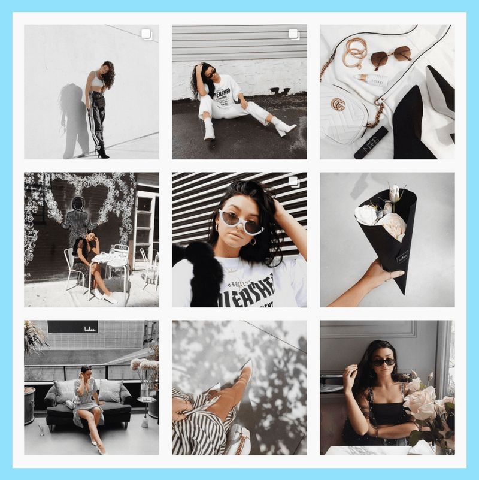  
  
  
  
  
  
I personally see this phenomenon as driven by a desire for:  
- performance, hence the creation of User Experience (UX) as a way of driving the navigation of a website into a certain direction through design choices;  
- productivity, with for example the 3-clicks rule, “based on the belief that users of a site will become frustrated and often leave if they cannot find the information within the three clicks.” (Wikipedia);  
- technicality, with the use of shady %% ==TOO SUBJ== %% methods to design websites: frameworks and libraries, JavaScript generated HTML or closed databases<sub class="note">[See: Brochier, 2023. and neal.fun, 2020]</sub>.  
  
The merge of those 3 pillars is Search Engine Optimisation (SEO), moz.com defines it as: “the practice of improving your website's content, structure, and visibility to rank higher on search engines like Google.”<sub class="note">[<a href="https://moz.com/learn/seo/what-is-seo">https://moz.com/learn/seo/what-is-seo</a>]</sub>, basically meaning it is a set of `<meta>` tags allowing for a bigger chance to appear on that so praised first page of search results. Already in 2005, Olia Lialina’s said in her Vernacular Web talk that “Search engine rating mechanisms rank the old amateur pages so low they're almost invisible and institutions don't collect or promote them with the same passion as they pursue net art or web design.” (Lialina, 2005). Today, 21 years later, nothing has changed.    
  
](THESIS/Final/media/seo.png)(./THESIS/Final/media/seo.png)  
  
This is the principle of technocapitalism; big corporations set rules that aim to ensure them money gain, and smaller companies or individuals are left with no other choice than “following the trend”. Technocapitalism is “characterized by the dominance of technology-driven capital, where technological innovation becomes a central component of economic growth and wealth accumulation.” (Wikipedia)    
A good explanation of how technocapitalism influences and acts on the web is given in Parimal Satyal’s article Rediscovering the small web (Satyal, 2020).    
In the end, it makes things very hard for independent artists or beginners to make room for their practice. They remain out of the first page of search results, invisible, shadow-banned<sub class="note">[“A method of banning users where their posts are visible only to them.” (Urban Dictionary, 2011)]</sub> in a way that developer Molly White explains accurately:  
> “Websites outside of these handful of social networks are harder and harder to even find, and partially because of that, they have a harder and harder time sustaining themselves. What is out there is buried among ever-growing piles of useless content farm material or, increasingly, AI-generated garbage.” (White, 2024)  
  
Those implicit rules are set so hard in stone that they have been going on for more than 20 years, enforced by the rules of the website-building platforms. For example, wix.com expects that the template “follows the good practices of of UX/UI design and the trends of its field” (Maudet and Ramstein, 2024).   
  
Since 2020, the web is witnessing a new rise of experimental websites. Neocities<sub class="note">[Neocities works in the same way as GeoCities did (see note 34 or <a href="https://neocities.org/about">https://neocities.org/about</a>)]</sub>, the proud successor to GeoCities<sub class="note">[“GeoCities, later Yahoo! GeoCities, was a web hosting service that allowed users to create and publish websites free of charge, and to browse user-created websites by their theme or interest, active from 1994 to 2009.” (Wikipedia)]</sub>, is getting more and more popular, Tumblr never really fell down in spite of its numerous dramas, small website builders are also flowering all over the web<sub class="note">[See: <a href="https://wwwobble.org/">https://wwwobble.org/</a>; <a href="https://kitten.small-web.org/">https://kitten.small-web.org/</a>; <a href="https://w.club1.fr/">https://w.club1.fr/</a>; <a href="https://zonelets.net/">https://zonelets.net/</a>; <a href="https://home.omg.lol/">https://home.omg.lol/</a>; <a href="https://my.public.monster/">https://my.public.monster/</a>]</sub>.    
A general tiredness towards polished and seamless websites that all look the same (Garay Murcia, 2026), as well as towards the ownership of the webspace put in the hands of a few big tech companies has opened a door to rebellion (Farrell and Berjon, 2024; Mandeville, 2016; Murray (no date); White, 2024; White, 2017; Zuckerman, 2025; and Appendix 3.a).   
This sense of tiredness I am talking about is well put into word by Daniel Murray, who noticed that during the COVID-19 pandemic “a lot of people discovered the history/practice of homepages and were interacting with the web much more purposefully than they had in the past.” (Beynon and Murray, 2025), pulling away from social media.    
I observe that this tiredness, on top of the novelty effect, has also played a part in the increasing use of Generative Artificial Intelligence (GenAI) tools. Those generators mostly produce images using overly saturated colours, abstract or hyper-realistic shapes that offer a seemingly good alternative to smooth grid/Instagram-like visuals.  
  
   
  
The issue with that is that those tools actually follow the same rules and objectives: performance, productivity and technicality, using questionable methods, such as the use of “magic” semantics, which I will detail later. Besides the disastrous impact GenAI-producing companies have on the environment, the economy and human ethics, they also rely on manipulation and gas-lighting to achieve their goals.  
  
By merging GenAI and WYSIWYG website-makers, we encounter more and more templates that don’t even need to be edited, as the people will be able to generate their own content (text, images, sound, video) through an AI bot. The result of this is what writer and activist Cory Doctorow calls “the enshittification of the web”:  
> “So what’s enshittification and why did it catch fire? It’s my theory explaining how the internet was colonized by platforms, and why all those platforms are degrading so quickly and thoroughly, and why it matters — and what we can do about it.” (quoted in Maudet and Ramstein, 2024).  
  
<div id="aside">Extra note: I decided for that reference before Cory Doctorow published his blog’s 20 years anniversary post, in which he defends his use of a LLM to help him proofread his blog articles; a practice I do not align with morally (<a href="https://pluralistic.net/2026/02/19/now-we-are-six/#stock-buyback">https://pluralistic.net/2026/02/19/now-we-are-six/#stock-buyback</a>). However, for the sake of my point, I decided to keep that reference and add this disclaimer. For an overview of why I disagree, read Jürgen Geuter’s blog post: <a href="https://tante.cc/2026/02/20/acting-ethical-in-an-imperfect-world/">https://tante.cc/2026/02/20/acting-ethical-in-an-imperfect-world/</a></div>  
  
This polished environment has consequences on our behaviours, as individuals and inside communities. It also has consequence on the vast topic of magic, including but not exclusive to my personal definition given in the introduction of this article.  
  
### 2.2 Losing our singularity: paradoxes and automation   
With that grand homogenisation of the web’s visual land, we face a paradox between wanting to stand out and blending in. We often see people, mainly artists of any field, complaining and struggling. They might come from any end of the spectrum: those who decided to embrace the flow and the standards blend so much that by looking like anyone else’s their portfolios remain unseen; those who on the contrary decide to go for a very personal portfolio would have websites that are so different and crafty that they might not be pushed forward by algorithm, remaining in the underground scene or invisible. A specific example is mentioned in Goree et al.’s research:   
> “P4<sub class="note">[participants in the research remained anonymous and were attributed the letter P and a number as an identifier.]</sub> said that he stopped using Flash for interaction because Google would not index text inside Flash components. P4 and P6 point to Google search’s 2015 ‘Mobilegeddon’ update, which suddenly prioritized search results which would display well on mobile, as the reason the web adopted responsive design.” (Goree et al., 2021, p. 12).   
  
That paradox makes it harder and harder for artists and creators to make a living and is getting all the more emphasised by GenAIs, as anyone can label themselves artists even if their creations are results of the calculations of a machine.  
   
Besides that paradox, another concept is bringing us to a loss or confusion of our identity and singularity: automation.    
In her article Algorithms vs Interaction Design, Nolwenn Maudet explains that AI designers aim to anticipate our intentions, which would then lead to “automating everything, eliminating all interaction” (Maudet, 2024). This would be very deplorable as the web is all about interaction: servers (computers) interacting with one another, people as well, and the whole field of Human-Computer interaction. By removing interaction through the anticipation of intentions, we stop thinking, for all is automated and done before we even think about it. Let’s not forget the brain is a muscle and thinking, reflecting is its exercising…    
Additionally, in her newsletter post When we walk away from the lying machines, anarchist and anti-fascist author Margaret Killjoy explains the shift in our collective way of thinking that might be operated by the growing usage of GenAI: the current generation of people believe what they see online is true, we have been taught to believe evidence when we see it with our own eyes. However, more and more content is being machine-generated and fed to us, so our very perception of reality is challenged. She writes that unlike our current adults generation, a child born today will never be able to trust anything they see online, as they would have grown up in an AI-generated online space. She elaborates: “they might simply assume that every image and text was generated by the monstrous lying machines that sit in warehouses just outside our cities and suck up all our water and power.” (Killjoy, 2026).    
Thus, what makes the web human will be gone.   
  
Not only GenAI is perpetuating a toxic environment where a few billionaires can take all our data and communities hostage, I fear that it is also stealing and reshaping the whole magic discourse as we know it.    
“Narratives of magic and mystification recur throughout AI’s history, drawing bright circles around spectacular displays of speed, efficiency, and computational reasoning.” That is what Kate Crawford writes in her Atlas of AI (Crawford, 2021, p. 207), describing later on that, from the beginning in the 1950s, Artificial Intelligence has been introduced as “magical”.    
Today, the whole communication/advertising plan of GenAI companies relies on a saturation and over-use of symbols and analogies. In a research paper written collectively by Annaëlle Beignon, Nolwenn Maudet and Thibault Thomas for Limites Numériques, they list the various graphical elements pertaining to magic used by AI programs (the sparkle icon ✨, blue-mauve gradients), but also the mechanics shared by both disciplines: invisibilisation of the processes, grey-areas (as in different companies using the same icon for a multitude of unrelated functionalities). They conclude that analysis by saying:  
> “We don't know how should behave something magic : is it normal that it takes time ? Did I do something wrong ? Is its resources consumption justified ? Making the machine invisible through the metaphor of magic changes the relation people have to tools. It is not possible anymore to pay attention to the machine.” (Beignon et al., 2025)  
  
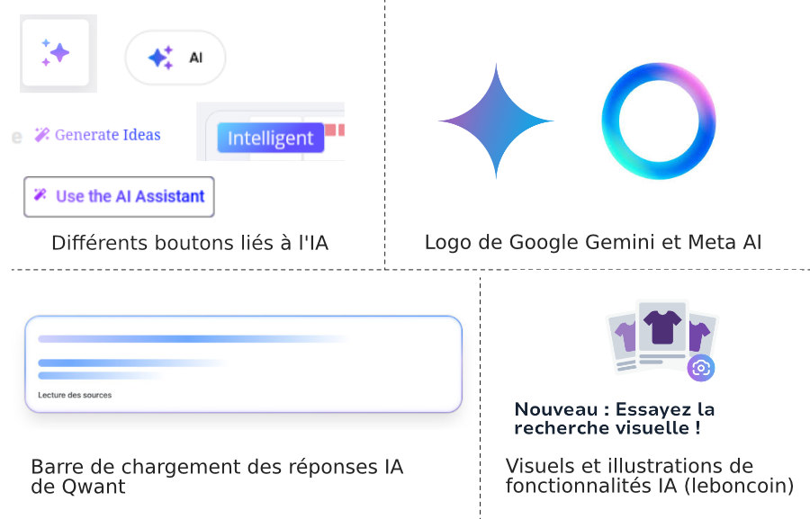  
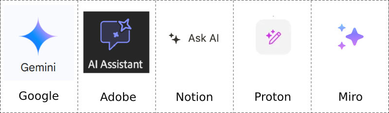  
  
Behind that sparkly and attractive image, GenAI hides all the horrors of its work: slavery and abuse, energy and resource consumption, plagiarism, etc. As pointed out by Kate Crawford in her Atlas of AI, “We need a theory of AI that accounts for the states and corporations that drive and dominate it, the extractive mining that leaves an imprint on the planet, the mass capture of data, and the profoundly unequal and increasingly exploitative labor practices that sustain it.” (Crawford, 2021, p. 19).    
Therefore, I draw a direct comparison between GenAIs and stage magicians: they pass tricks and optical illusion for magic, but they really are a smokescreen, manipulating minds to believe their technique is actual magic. If any AI program is "magical" it is merely a trick on the mind, making people (the audience) believe something is happening when it actually is a smokescreen. If its "magic" comes from the fact that "we do not quite understand what it does and how" it is because it advertised as making things easier and faster than a human. This thought process was triggered by the movie Wicked: For Good. The revelation of the Wizard’s treachery made me instantly think of the marketing and advocates’ discourses about GenAI and Large Language Models (LLM).    
Later on, I enriched this opinion by looking at sociologist Dominique Cardon, who writes: “Algorithms that claim to be predictive are not predictive because they have managed to penetrate people's subjectivity to fathom their desires or aspirations. They are predictive because they constantly assume that our future will be a reproduction of our past.” (Cardon, 2015 in Maudet, 2024a). This principle is also described by Kate Crawford and Alex Campolo as “*enchanted determinism*: AI systems are seen as enchanted, beyond the known world, yet deterministic in that they discover patterns that can be applied with predictive certainty to everyday life.” (Crawford, 2021, p. 210).  
  
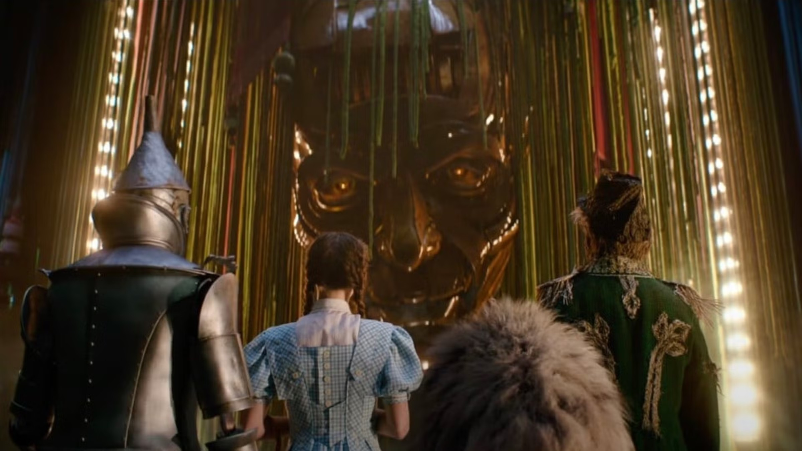  
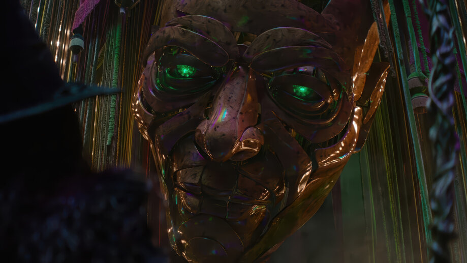  
  
So I ask, why, when dressed up as a magical entity, GenAI seems to be looked upon as a good thing, leaving behind any reference to intention, intuition, emotion? A lacking covered by Ted Chiang in his article Why AI isn’t going to make art (Chiang, 2024).    
In opposition, a hand crafted website therefore acts as a counter-spell, for the fact that we can inspect, replicate and adapt its code, thus understand it, learn and become able to recognise and shape our own intentions.  
  
Of course, as M. Killjoy also writes, this shift towards automation might very well lead us back to embracing more face-to-face interactions, with other human beings, which would be quite positive (Killjoy, 2026). But I believe we can also act now, as communities, so that neither the web nor our *in real life* interactions disappear.  
  
We must collectively help each other to break the curse and stop being ghosts of ourselves, imprisoned in the seamless shells of algorithmic recommendations.    
In order to do so, one way is to step back and (re)teach ourselves to embrace silly, different, *personal* web practices.  
  
Together, we can perform the ritual that will counter the hyper-capitalism being so trapped within itself that it turns to fascism.  
  
  
## 3. Follow the white rabbit: the ritual  
I would like to make a final stop on this journey. We can stop to observe how the mechanics explained above serve a fascist political agenda, and from there, activate our hive mind to face danger and act accordingly.    
These actions will resonate with historian Johan Huizinga’s observation that one of the most notable sign of the rise of totalitarian powers is the loss of play to seriousness (Huizinga, 1955).  
  
### 3.1 Cyberpunk: aesthetics vs ideology  
I demonstrated how the digital environment is becoming more and more polished and unified visually. Another strategy used by hyper-capitalism and totalitarian movements is rooted in gamification: the use of game tactics and patterns to appeal and trigger engagement.    
To illustrate how fascism uses gamification to enforce its political agenda, I will use the cyberpunk imaginary.  
  
From my own observation and acquaintance with it, I define cyberpunk as a narrative deeply rooted in capitalistic grounds: it depicts a plausible future induced by an over-ruling capitalism. Classes have disappeared, inequalities being so deepened that only two extremes can sustain: the very poor and the very rich. There is no in-between anymore. In this system, vices are emphasised, society is wounded so badly it falls into an overly sexually-driven and drug-consuming chaos.    
In all cyberpunk stories we find common elements: struggles involving life-or-death choices, machines and artificial intelligence of all kinds are merging with every aspect of human life.    
Graphically, we often face dark atmospheres lit up by neons and flashing colours. The cyan-magenta-yellow-black (CMYK) combination is a signature and capacity-enhancing body implants are like common clothing.    
  
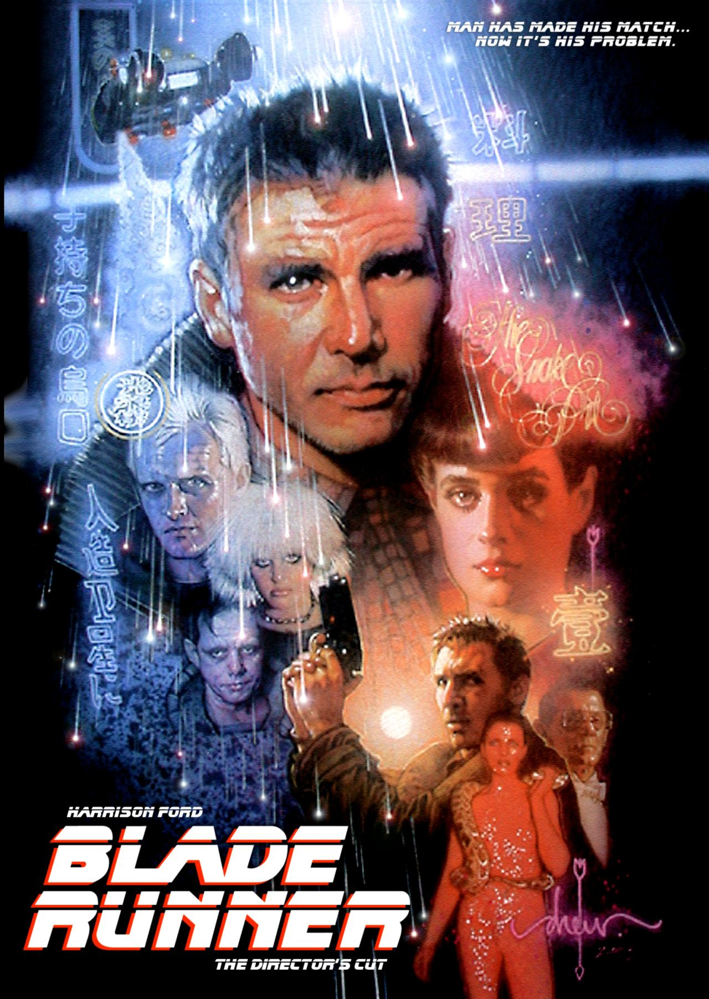  
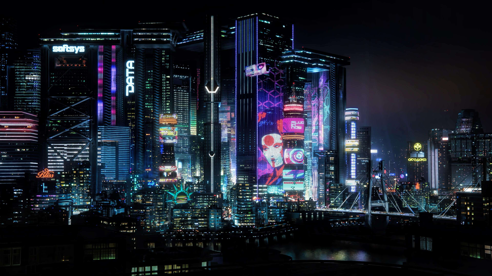  
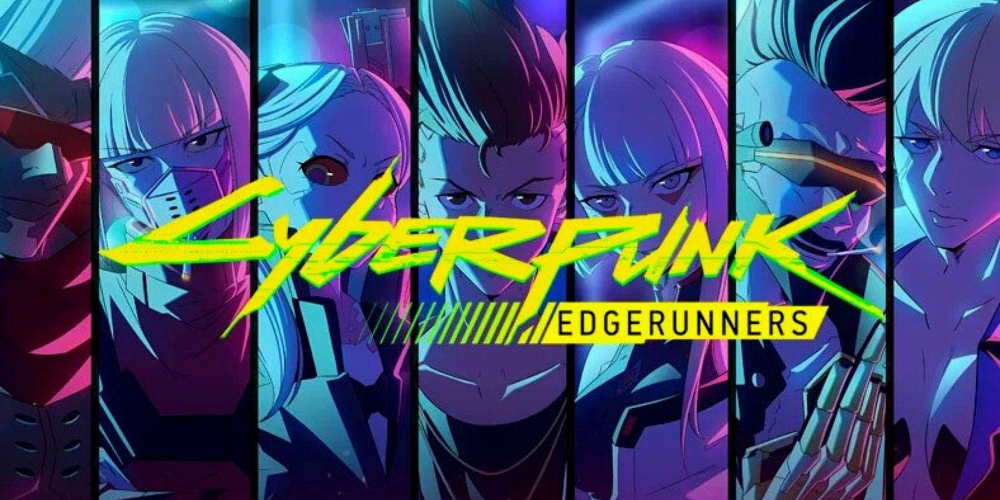  
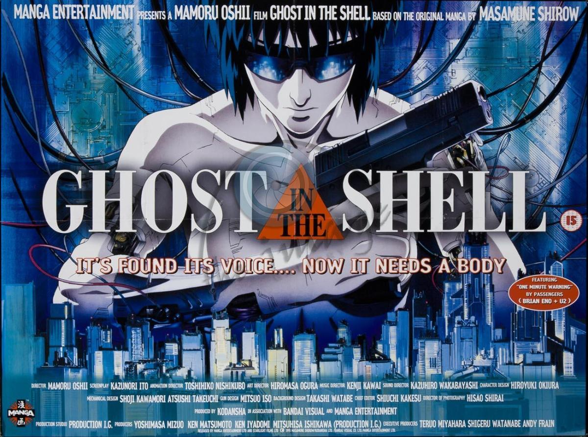  
  
The cyberpunk narrative is meant to criticise politics and economics, stating that if we don’t stop and think, the future will become this dystopia. That is why cyberpunk’s use of politic entanglement and rebellion from the people are key recurring themes across stories: Matrix (1999), Cyberpunk: 2077 (2024), Blade Runner (1982), Ghost in the Shell (1995) are examples.    
The cyberpunk genre depicts mostly stories of societal collapse, building the perfect ground for rebellion. The current state of economics and politics is actually quite close to the atmosphere described by cyberpunk pieces. This is what Asma Mhalla explains in her essay Cyberpunk : Le nouveau totalitarisme; she demonstrates that the future is here, we are currently living the cyberpunk dystopia depicted in so many science-fiction scenario since the 1980s.    
In this essay, Mhalla carefully unveils the mechanics at play in the cyberpunk ideology of our days, building her analysis on the recent events that occurred in US politics. She explains thoroughly how deeply rooted in technology those events are, relying on a president that has only faith in the sparkly, the shocking and the show. Reading that, I can only see Donald Trump as the ultimate stage magician, who took Elon Musk as his assistant for a while, thus stating his motives and interests in AI programming and machine-ruled systems.    
  
![[THESIS/Final/media/trump-musk02.webp|Image credit: Kevin Dietsch (Getty Images).  
  
The all-automated, machine-centred and efficiency-driven future depicted in cyberpunk dystopiae is actually the present we are building (Mhalla, 2025). Only, cyberpunk isn’t just a skin-pack<sub class="note">[from the video-game jargon; a skin is a decorative, cosmetic element such as an outfit or a charm a player can assign to their avatar]</sub> coating everything in CMYK-saturated colours and body implants, it comes with an ideology, politics. That ideology is now being more and more embodied by GenAI tools and platforms, as Asma Mhalla points out: “Les *mass technologies* sont devenues l’infrastructure cognitive, sociale et politique du nouveau régime. […] Nous avons basculé dans l’univers cyberpunk au moment exact où ces hypertechnologies ont cessé d’être des outils pour devenir l’environnement qui nous fabrique. (*Mass technologies* have become the cognitive, social and political infrastructure of the new regime. […] We entered the cyberpunk universe at the exact moment when these hypertechnologies ceased to be tools and became the environment that shapes us.)” (Mhalla, 2025, p. 98; Translated by myself).  
  
In my own professional life, while working on the french translation for [howtotrainyourchatbot.com](https://howtotrainyourchatbot.com), a LLM explainer built by Decifer Studio<sub class="note">[<a href="https://decifer.tech/">https://decifer.tech</a>]</sub>, I came across the phrase: “You will see a question with two answer options generated by the model, and pick what you think is the better answer. Real chatbots similarly learn patterns from thousands of choices made by humans, often workers hired for this task. What counts as 'better' depends on who's deciding.” (Decifer Studio, 2026) and that made me think that political tyranny is reenacted on every corner of the web space. The people behind GenAI ideology are the same that rule the web (by having the most seats at the World Wide Web Consortium (W3C)<sub class="note">[The W3C is an international organisation that sits together to set rules, standards and constant evolution to the web. The biggest actors are companies such as Google, Apple, Adobe, etc.]</sub> for example), so they have all the power to enforce their bots in every tool and web service we use. Ultimately, we realise that they are also the same people that rule the world.    
  
](THESIS/Final/media/train-chatbot.png)(./THESIS/Final/media/train-chatbot.png)  
  
Indeed, besides funding all the GenAI companies and enforcing their products everywhere, politicians and especially (far-)right activists have fully embraced and understood the mechanics of social media. They also understand and take advantage of game elements to appeal to masses. For example, Donald Trump in the US and Marine Lepen in France, both part of the far-right political canvas, have become memes, thus making themselves.    
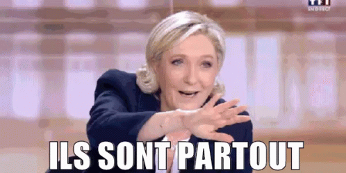  
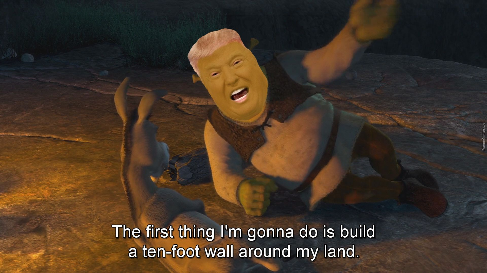  
  
Researches show the power and influence of social media on political opinions (Sugihartono, 2024; Evans and Boucher, 2025). It is also no secret that since Elon Musk bought Twitter and rebranded it X, the platform has been a safety haven for right-winged opinions, as Leila Register explains for CBN News (Register, 2024).  
  
In a nutshell, what used to be science-fiction is slowly becoming reality, wrapped under a sparkly ✨ veil. Politicians and Silicon Valley billionaires are feeding us a story, except this one doesn’t even bother to let us chose between the blue or the red pill.     
Cyberpunk is a story, that is how it started.    
Fascism is also a story. At least, according to Katika Kühnreich.    
In her talk All sorted by machines of loving grace? for in 39C3<sub class="note">[The 39th Chaos Communication Congress]</sub>, she said:  
> “Stories can help us, give us guidelines, hope. Can make us believe that if we follow that story's rules, everything will be easy. But we have to be careful what kind of stories we believe in.    
> Because fascism is a story. And sometimes it's very well told.     
> And cybernetics is a story as well. A mechanical fairy tale.” (Kühnreich, 2025)  
  
During this talk, Kühnreich demonstrates further this statement by explaining that, in her own words, fascism is a promise “to go back to a past that never existed.” (Kühnreich, 2025)    
To me, this is also exactly what cybernetics do by trying to give life to science-fiction; promising it will solve all our problems. But are those problems even real? Will a conversational bot solve the war in Gaza? In Iran? In Ukraine? and so on…  
  
In Weird Economies’ podcast The Exploits of Play, writer Vicky Osterweil also describes fascism as a story. She explains that fascism turns facts into stories to serve their agenda. “For the fascists the only game is power ultimately the fun that they have is the expression of power.” (Haiven and Harvey, 2025). For that reason, they deliver discourses without meaning, always counting on ambiguity and abstraction; they build their entire image on “fantasies of domination and power”, never acknowledging that power is a relationship – one cannot have power if that power is not over someone or something else.  
She also shows how gamification became a tool, leaving people not even feeling they’re playing a game. It is the same gaslighting principle that GenAI uses.     
Additionally, Osterweil describes fascism as “fun without pleasure” and explains why pleasure and joy are actually the “space of encounter for organising – if you can organise a DnD<sub class="note">[Dungeons and Dragons, the tabletop roleplay game]</sub> encounter, you can organise a movement”. (Haiven and Harvey, 2025).    
We are now at a time to create rebel coalitions. To reclaim the web and the sense of community, as a counter-action to GenAI and fascism advocates.  
This is, as I observe, why indie web practices are getting more and more popular. More and more people leave mass social media to join the fediverse, through BlueSky or Mastodon for example. More and more events put federation, community building and alternative tools as their central focus %% ==give examples== %%  
  
The Exploits of Play podcast episode ends with Osterweil asking: “what if we played the game of revolution?”, which brings me to my last point: how playfulness and fun serve the revolution; that I will illustrate through examples from indie web creators.  
  
### 3.2 Let’s make a website about it!  
“Let’s make a website about it” comes from my friend Queenie F. Charles and it is the philosophy I invite you to switch on in this part.    
Playfulness cannot be the sole property of fascists and extremists. As a matter of fact, the playfulness they display has nothing to do with the one I will describe as a rebellion tool.    
  
As mentioned throughout this whole article, the state of the web is currently unstable, taken over by big Silicon Valley corporation, pushing GenAI slop in everything, until we all become numb. But we don’t have to passively fall into that numbness.    
In her article From the Philosophy of the Open to the Ideology of the User-Friendly, Lori Emerson reminds us how computers used to be accessible to their users, offering the possibility to become hardware-savvy, and how through time, they become less and less operable and changeable, thus turning into mysterious black boxes that we expect to just work (Emerson, 2013). This system is creating the great seamlessness, valuing templates and drag-and-drop website builders instead of the craft of HTML and CSS mentioned before.  
  
Given what I stated through this article, we can deduct what GenAI cannot do is create, have imagination. It recycles and remixes already realised ideas. It plagiarises and steals. In a nutshell, since GenAI can’t fake it, I suppose it means that as humans, our singularity lies in our imagination; a belief that is well captured by Johan Huizinga: “Behind every abstract expression there lie the boldest of metaphors, and every metaphor is a play upon words. Thus in giving expression to life man creates a second, poetic world alongside the world of nature.” (Huizinga, 1955). It is our capacity to create things, for their beauty or their amount of fun, regardless of their uselessness.    
People designing GenAI tools (E. Musk, S. Altman, etc.) are driven by profit and use, functionality, performance. Therefore these tools cannot conceive the importance of the useless. As, in order to invoke the silly, you must above all know the difference between being intentional and accidents, and how to use both.  
  
To perform this invocation, I uncovered a protocol:  
1. We must bring the people back as the priority.    
As shown through the example of GenAI design, the web has become more and more focused on providing an experience. But not as in the experimentation, accidental and exploring experience. More as a polished, un-personal, templated experience.    
As Maria Farrell and Robin Berjon wrote in their article We Need to Rewild the Internet, “For tech giants, the long period of open internet evolution is over. Their internet is not an ecosystem. It’s a zoo.” (Farrell and Berjon, 2024), meaning that everything is categorised and ordered, zoo cages being a good analogy for the grid templates offered by WYSIWYG website builders, taking agency away from the people.    
By leaving this “experience” behind to actually focus on people, we can regain agency, obtain better personal control and independence.   
  
2. Cast your mind back to childhood<sub class="note">[Borrowed from Vicky Osterweil (Haiven and Harvey, 2025)]</sub>    
Totalitarian systems compel us and push us to find purpose, to have a reason, a use for everything we say and make. That’s also the principle of design; art with an applied function, and I find that terribly sad. It always made me feel like an outcast, because sometimes it is very nice to do things because we appreciate them or because they ‘feel right’.     
As Johan Huizinga demonstrates in his book Homo Ludens, play is an inherent part of life and losing playfulness gives way to seriousness, leading to extreme political situations (Huizinga, 1955). Meaning that, in order to fight those political crises, we need to embrace playfulness.  Here is what I propose: let’s embrace the useless, for the sake of fun; let’s embrace the goofy that makes us feel good; let’s embrace each other, to build long-lasting communities and help each other in tending our gardens.    
We have to embrace that playfulness in order to create a basis for new ideas to spring. Combining play and uselessness, we drop expectations and stereotypes imposed by society and let our imagination wander.   
  
3. Weave connections    
For the rebellion to happen, we need to connect, share, link. Gather in magic circles, full of intentions and will.    
The web is fantastic for it is “for everyone”, as Tim Berners-Lee and so many others said and (will) keep saying. To maintain the web as a people-based platform, in the sense that it is made by and for the people, we, webcrafters and citizens of the small/slow/indie/… web need to advocate together for a return of the people as creators and not consumers. That way only we can stop this vicious doom-scrolling cycle that is “removing us from what meaningful intimacy & community felt like.” (Desroches, 2026).    
By coding, sharing and caring for our personal corners of the web, we might very well end up weaving and nurturing relationships, links. As the web was intended for. And by nurturing, we may enlarge the community, and reverse the tendencies, at least for a time.   
  
To recreate an environment prone to uncensored self-expression and community-building, we must observe how they came to be in the first place. Through spontaneity. This urge to engage in an action without having our brain processed it yet. This very spontaneity brings along a sense of silliness, for it might create quiproquos or absurd situations. So this is indeed what we must nurture for now, so it can grow again and disturb the all-powerful flex-box<sub class="note">[<code>flex-box</code> is a CSS layout property that allows a somewhat flexible grid layout for a web page.]</sub>.  
  
Many web crafters are coming forward, offering new experimental web tools to play with. This is the case of wwwobble.com, zuckgotmefor.com, neal.fun or gradient.horse.  
  
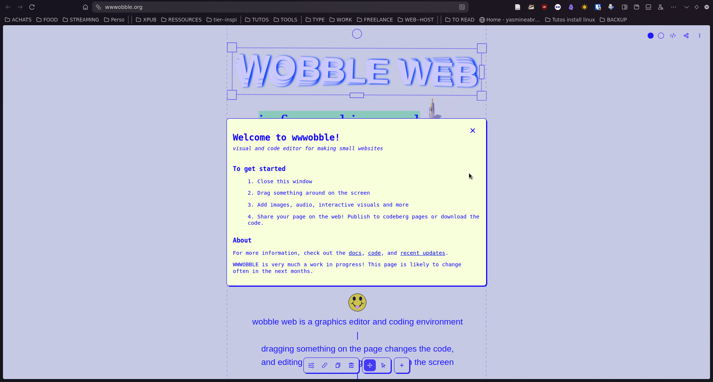  
  
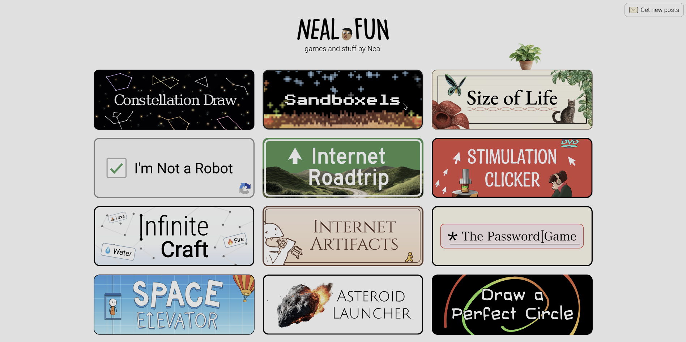  
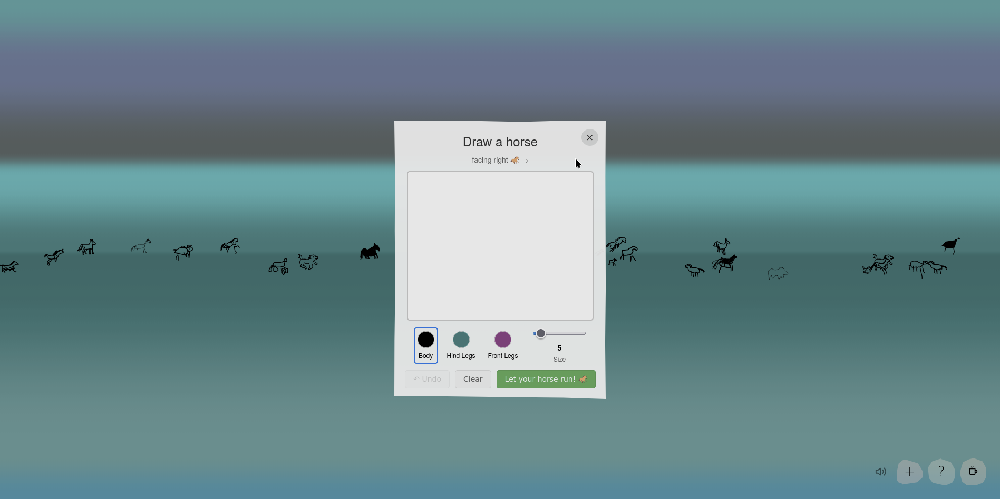  
, [https://neal.fun/](neal.fun), [[https://wwwobble.org](https://zuckgotmefor.wixsite.com/zuck)/](zuckgotmefor.wixsite.com) and [https://gradient.horse/](gradient.horse)](THESIS/Final/media/horse02.png)  
  
Those sites bear different amounts of usefulness, that could be interpreted through different lenses. What they do all share is a certain distance from gridified, rigid, compliant websites (referring to the W3C standards), and a desire to embrace “fun”.  
  
Daniel Murray is a key actor in this field, but he is far from being alone. As mentioned in chapter one, the indie web movement *is* what it is; a movement. This means it is held by a, or several, communities. As a result, a plethora of articles and blog entries focus on its principles and ethics. It is the case of writer and designer Henry Desroches who published recently A website to end all websites. This manifesto-poetry-like webpage depicts similar issues as the ones I pointed here. It is an ode to personal websites, that Desroches describes as “a staunch undying answer to everything the corporate and industrial web has taken from us.” (Desroches, 2026).<sub class="note">[For more views, see: Lialina, 2005; Carpenter, 2015.]</sub>  
  
To conclude this point, I’ll explain why I titled it “Follow the white rabbit”. This chapter is about cyberpunk aesthetics, ideological manipulation and using amazement, spontaneity and absurdity to fight back. In the first Matrix movie (Wachowski Sisters, 1999), the reference to Alice’s Adventures in Wonderland is made clear, when Neo is prompted to follow the white rabbit. The resources and practices described in the second part of the chapter can also take inspiration from Alice’s universe, and often does in my opinion. Hence the title.  
  
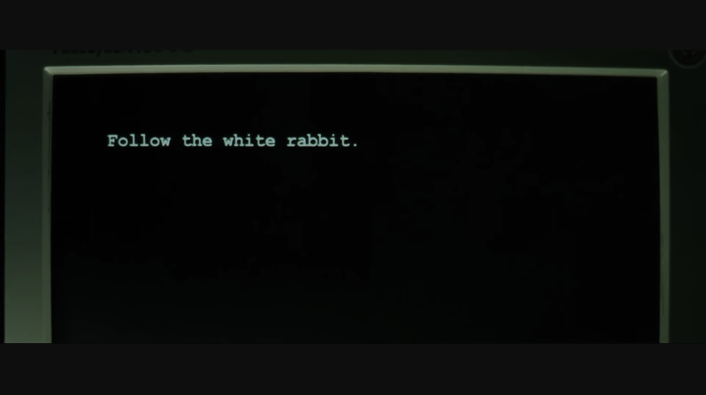  
  
## CONCLUSION  
```  
<!-- Something about getting back to doing things a certain way because we want to, and not because it will please an algorithm of fade in the crowd. Starting ti put intention back.  
++ make point: not about nostalgia of something I didn't experience, more about a new form of it, that is the least exclusionary possible -->  
```  
By observing the web as craft, we can reconnect to what makes it so rich, we can make it a space to express our differences, highlight our cultures and beliefs, out humanity.    
Just as play is inherent to both humans and animals, the web can be that space beyond borders. If we gather around the intention, we might just find a way to act towards this goal.  
  
While talking with Raphaël Bastide<sub class="note">[see: Apendix 2.b]</sub>, we agreed on a thing: magic resides in the balance between technicality and sensitivity. Let’s recognise the flaws of the machine and the ones of the living. For acknowledging them is the key to better embrace out sensitivity and create.  
  
In the story of Wicked, Elphaba discovers the treachery on which the land of Oz is built and tries to call it out. She is from then on called the Wicked Witch of the West. Her fight is of the utmost importance, but unrecognised. While processing it, I realised that this treachery is very similar to the one of Generative AI: a smokescreen, trying to make a carefully wired illusion pass for the truth, for magic, as if nothing had consequences.    
So our fights connect: we both fight against a system, for singularity, for difference and against discrimination, we fight a well-oiled machine but there is a chance it will simply betray himself, lost in its own lies.  
  
Webringing, hyperlinking and mazing are my spells.    
Expressing and praising singularity are my intentions.    
Seamlessness and automation are my combat.  
  
I am the Wicked Witch of the World Wide Web.  
